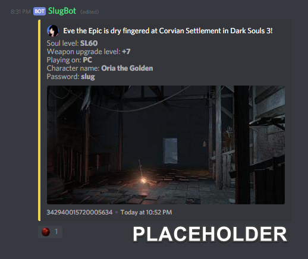
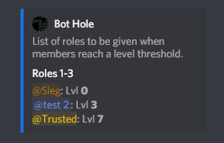
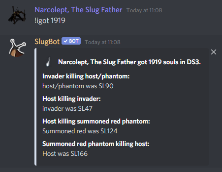

# Discord commands

This page provides an easy reference for all of the available SlugBot commands for Discord.

---

## `!addbuild`
```
!addbuild [build name] [soul level] [upgrade level] <link>
```

Used to add a build to your build list. Stating `soul level`, `upgrade level` and `build planner link` are optional but recommended. If a soulsplanner link is suplied, any missing data will be taken from the build directly - often, all thats needed.

Requirements to use command:
- None

Examples:
* `!addbuild Vilhelm's Squire SL60 +7 https://soulsplanner.com/darksouls3/1381` This will add a build by the name of 'Vilhelm's Squire' to the build list. If a build by the same name already exists in the list, its information will be updated with the new information stated.

* `!addbuild https://soulsplanner.com/darksouls3/1139` This will take the name, soul level, and upgrade level directly from the build linked.

---

## `!removebuild`
```
!removebuild <build name | build number>
```

Used to remove a build from a streamer's build list.

Parameter `<build name | build number>` allows the following values:
- Name of existing build (case insensitive)
- Number of existing build (can be found using the `!build` command)

Requirements to use command:
- None

Examples: 
* `!removebuild Vilhelm's Squire` This will remove the build 'Vilhelm's Squire' from the build list. Build name is case insensitive.

---

## `!build`
```
!build [member]
OR
!builds [member]
```

Used to view your own build list or the build list of another member.

optional parameter `[member]` allows the following values:
- Discord username of member
- Discord ID of member
- member mention

Requirements to use command:
- None

Examples:
* `!build @Tikaro` This will show Tikaro's build list.

---

## `!addcommand`
```
!addcommand <command> <response>
```

Used to add/edit a custom command that will respond with a specified string. alternatively regex can be used in place of a command to make SlugBot send a response message whenever the regex matches a members message.

The response can contain certain replacer flags that will be replaced will specific values when sent by slugbot.

Parameter `<command>` allows the following values:
- New command string
- Existing command string. Will overwrite its response
- Regex keyword, indicated by a string starting and ending with `/`

Parameter `<response>` allows the following values:
- Any string that will be displayed when the custom command is used or the regex is matched.

The response allows for the following replacer flags:
- `${count}`. Will be replaced with the number of times the command has been used
- `${name}`. Will be replaced with the displayname of the member who used the command
- `${id}`. Will be replaced with the discord ID of the member who used the command
- `${value}`. Will be replaced with a number value that can be modified by moderators. Moderators can modify the value by appending `++`, `--`, or a Number to the end of the command when used.
- `${rand:{weight}option 1|{weight}option 2|...}`. Will randomly chose one of the options to replace the flag with. `{weight}` is optional and should be a integer value. (e.g `{2}`). Options can be any valid string and there can be any number of options separated by the `|` character. 

Requirements to use command:
- `botAdmin` role
- `ADMINISTRATOR` discord permission
- Server owner

Examples:
* `!addcommand flip You flipped a coin and got ${rand:heads|tails}!` This will add a command that will respond with `You flipped a coin and got heads!` OR `You flipped a coin and got tails!` when the command `!flip` is used.
* `!addcommand /don't\s@\sme/ <@${id}>` This will create a regex keyword match that will respond with a discord mention whenever a message contains the string `don't @ me`.

---

## `!removecommand`
```
!removecommand <command>
```

Used to remove an existing custom command.

Parameter `<command>` allows the following values:
- Existing command to remove
- Existing regex keyword to remove

Requirements to use command:
- `botAdmin` role
- `ADMINISTRATOR` discord permission
- Server owner

Example:
`!removecommand ping` This will remove the custom command `!ping`.

---

## `!commands`
```
!commands
```

Used to get a list of all custom commands in the server DMed to you.

Requirements to use command:
- None

Requirements to get regex keywords included in list:
- `botAdmin` role
- `ADMINISTRATOR` discord permission
- Server owner

---

## `!constraint`
```
!constraint <command> [<whitelist|blacklist|remove> <channel|role|member>]
```

Use this command to add channels, roles, and members to a command's whitelist or blacklist. __WHITELISTS AND BLACKLISTS TAKE PRIORITY OVER DEFAULT COMMAND PERMISSIONS.__
* A command can only be used in whitelisted channels. If There are no whitelisted channels, the command can be used in every channel.
* A command can only be used by members with whitelisted roles. If There are no whitelisted roles, all roles can use the command.
* A command can only be used by whitelisted members. If there are no whitelisted members, all members can use the command
* A command can not be used in blacklisted channels.
* A command can not be used by members with blacklisted roles.
* A command can not be used by blacklisted members.

Requirements to use command:
- `botAdmin` role
- `ADMINISTRATOR` discord permission
- Server owner

---

## `!setchannel`
```
!setchannel [<channel to set> [reset]]
```

Set channels for SlugBot to use. `!setchannel` with no arguments will show information on which channels have been set.

Parameter `<channel to set>` allows the following values:
- `default`, main channel
- `leaderboard`, channel with the Leaderboard
- `streams`, channel for live notifications about streams
- `memberevents`, channel for active Member Events
- `log`, discord logging
- `slugboard`, channel used for slugboard messages 
- `micmuted`, channel for mic-muted VC communication

Optional parameter `[reset]` allows the following value:
- `reset` to unset the stated channel

Requirements to use command:
- `botAdmin` role
- `ADMINISTRATOR` discord permission
- Server owner

Examples:
* `!setchannel default` This will set the current channel to be used as the default channel by slugbot. This will produce the following message:


* `!setchannel default reset` This will unset the default channel, disabling any slugbot functionality that uses the default channel.


---

## `!setrole`
```
!setrole [<role to set> <reset | role name>]
```

Set roles for SlugBot to use. `!setrole` with no arguments will show information on which roles have been set.

The `mute` role will be created and set automatically on the first use of a mute command if a role was not already set beforehand.

Parameter `<role to set>` allows the following values:
-	`mute`, mute role (auto-generated)
- `botAdmin`, bot admin role
- `global`, role assigned to all members
- `weeklytoprank`, role given to weekly top ranking member
- `totaltoprank`, role given to top ranking member
- `streamer`, role that adds members to the streamer list
- `pc`, PC platform role
- `ps4`, PS4 platform role
- `xbox`, XBox platform role

Parameter `reset` allows the following value:
- `reset` to unset the stated role

Parameter `role name` allows the following value:
- The name of an existing role in the server

Requirements to use command:
- `botAdmin` role
- `ADMINISTRATOR` discord permission
- Server owner

Examples:
* `!setrole totalTopRank Top Sleg` This will set totalTopRank to use a server role called 'Top Sleg'.

* `!setrole weeklyTopRank reset` This will unset the weeklyTopRank role, disabling any slugbot functionality that uses the weeklyTopRank role.


---

## `!setwelcomemessage`
```
!setwelcomemessage <welcome message>
```

Use this command to customise the welcome message sent when a new member joins the server.

Parameter `welcome message` allows the following value:
- String welcome message

The `welcome message` string allows for the following replacer flags:
- `${member}`. Will be replaced with a discord mention of the member who joined.
- `${name}`. Will be replaced with the displayname of the member who used the command.
- `${rand:{weight}option 1|{weight}option 2|...}`. Will randomly chose one of the options to replace the flag with. `{weight}` is optional and should be a integer value. (e.g `{2}`). Options can be any valid string and there can be any number of options separated by the `|` character. 

Requirements to use command:
- `botAdmin` role
- `ADMINISTRATOR` discord permission
- Server owner

Example: 
* `!setwelcomemessage welcome ${member} to the server!` - `${member}` will be replaced with the new member's display name.

---

## `!streamer`
```
!streamer <add | remove | list> <streamer name>
```

Use this command to add a streamer to the streams notification list or remove a streamer from the list. A notification message will be sent to the '#streams' channel (if set) when a streamer in the list goes live on twitch.tv. The notification gets deleted when the streamer goes offline again.

Parameter `<add | remove | list>` allows the following values:
- `add`, to add streamer to streamer list
- `remove`, to remove streamer from streamer list
- `list`, to list all streamers in streamer list

Parameter `<streamer name>` allows the following value:
- twitch username of streamer

Requirements to use command:
- `botAdmin` role
- `ADMINISTRATOR` discord permission
- Server owner

Examples:
* `!streamer add Florador` This will add twitch streamer 'Florador' to the notification list.
* `!streamer remove Florador` This will remove twitch streamer 'Florador' from the notification list.
* `!streamer list` This will list all streamers currently set to display when they go live.

---

## `!mute`
```
!mute <member> [duration] [reason]
```

This command is used to mute members. Giving a `duration` and `reason` are optional. Not giving a duration will mute the user until they are manually unmuted. The member can be specified by ping, user ID or name.

Parameter `<member>` allows the following value:
- discord username/ID/mention of member to mute

Optional parameter `[duration]` allows the following value:
- Number value for mute duration in minutes

Optional parameter `[reason]` allows the following value:
- String reason for why the member was muted. Will be DMed to the member

Requirements to use command:
- `botAdmin` role
- `ADMINISTRATOR` discord permission
- Server owner

Example: 
* `!mute 2340287340287 10 For reasons and stuff.` This will mute the member with ID `2340287340287` for 10 minutes and DM them the reason 'For reasons and stuff'.


---

## `!unmute`
```
!unmute <member>
```

Use this command to unmute a muted member.

Parameter `<member>` allows the following value:
- discord username/ID/mention of member to unmute

Requirements to use command:
- `botAdmin` role
- `ADMINISTRATOR` discord permission
- Server owner

Example: 
* `!unmute Alex_` This will unmute member 'Alex_' if they are muted.

---

## `!roleatlevel`
```
!roleatlevel [<add|remove> <role name> <level> [send notification?]]
```

Use this command to set roles to be given to members once they reach a certain level. Using the command with no arguments will list all the roles and their levels at which they will be given.

Parameter `<add|remove>` allows the following values:
- `add`
- `remove`

Parameter `<role name>` allows the following values:
- Name of the role that will be given once a level requirement is met.
- role mention of the role that will be given once a level requirement is met

Parameter `<level>` allows the following value:
- An integer value corresponding to the level requirement of the role.

Optional parameter `[send notification?]` allows the following value:
- `true`. A message in chat will be sent when the member reaches the required level.
- `false`. A message will not be sent when the member reaches the required level.
- defaults to `true`.

Requirements to add and remove roles at levels:
- `botAdmin` role
- `ADMINISTRATOR` discord permission
- Server owner

Example: 
* `!roleatlevel Slug 10` This will set the `slug` role to be given to any member with a level greater than or equal to 10.

---

## `!giveme`
```
!giveme [<add|remove> <role name>]|[role name]
```

Use this command to set roles to be self-assignable or toggle self-assignable roles. Using the command with no arguments will list all self-assignable roles.

Parameter `<add|remove>` allows the following values:
- `add`
- `remove`

Parameter `<role name>` allows the following values:
- Name of the role that will be given once a level requirement is met.
- role mention of the role that will be given once a level requirement is met

Parameter `<level>` allows the following value:
- An integer value corresponding to the level requirement of the role.

Optional parameter `[send notification?]` allows the following value:
- `true`. A message in chat will be sent when the member reaches the required level.
- `false`. A message will not be sent when the member reaches the required level.
- defaults to `true`.

Requirements to use command to toggle self-assignable role:
- None

Requirements to use command to list all self-assignable roles:
- None

Requirements to use command:
- `botAdmin` role
- `ADMINISTRATOR` discord permission
- Server owner

Example: 
* `!roleatlevel Slug 10` This will set the `slug` role to be given to any member with a level greater than or equal to 10.

---

## `!avatar`
```
!avatar [member]
```

Use this command to view a fullsized image of a members avatar. Use the command with no arguments to view a fullsized image of your own avatar.

Parameter `[member]` allows the following values:
- Member mention
- Member username
- Member display name
- member ID

Requirements to use command:
- None

Example: 
* `!avatar Tikaro` This will display Tikaro's avatar.

---

## `!help`
```
!help [command]
```

Use this command to get info on how to use a specific command. Use the command with no arguments to get a link to this documentation.

Parameter `[command]` allows the following value:
- slugbot command

Requirements to use command with no arguments:
- None

Requirements to use command with specified command:
- Inherits permission requirements of specified command

Example: 
* `!help giveme` This will display documentation on the `giveme` command.

---

## `!math`
```
!math <mathematical expression>
OR
!maths <mathematical expression>
```

Use this command to calculate the value of a mathematical expression

Parameter `<mathematical expression>` allows the following values:
- A resolvable mathematical expression

Requirements to use command with no arguments:
- None

Example: 
* `!math 84^2 / pi` This will respond with the value of the expression.

---

## `!igot`
```
!igot [ds1|ds3] <souls received>
```

Use this command to get a readout containing the estimated level of another player killed in Dark Souls 1 or Dark Souls 3.

Parameter `<mathematical expression>` allows the following values:
- A resolvable mathematical expression

Requirements to use command with no arguments:
- None

Example: 
* `!igot 1919` This show the possible soul level of a player depending on their phantom type.


---

## `!names`
```
!names [member]
```

Use this command to get a list of past usernames and display names of a member. Use this command with no arguments to get a list of yourown past usernames and display names.

Parameter `[member]` allows the following values:
- Member mention
- Member username
- Member display name
- member ID

Requirements to use command:
- None

Example: 
* `!avatar Tikaro` This will display Tikaro's avatar.

---

## `!filter`
```
!filter <add|remove|list> <filter string>
```

Use this command to add or remove word filters in the current server. The filter string can either be a normal string or RegEx.

When a member sends a message in the server containing the filter string, their message will be deleted, score will be deducted and there will be a random chance they will be muted. the mute chance increases each time the same member triggers the filter.

If a normal string is given, common letter substitutions will be taken into account.

if RegEx is given, the matched message will be deleted but the member will not have score deducted or have a chance to be muted.

Parameter `<add|remove|list>` allows the following values:
- `add` to add the following filter.
- `remove` to remove the following filter if it exists.
- `list` to list all current filters.

Parameter `<filter string>` allows the following values:
- normal string containing word(s) to be filtered
- RegEx

Requirements to use command:
- `botAdmin` role
- `ADMINISTRATOR` discord permission
- Server owner

Example: 
* `!filter add snail` This will make SlugBot delete any messages containing the word 'snail', deduct score from the offending member and have a chance to mute them.

---

## `!filter`
```
!filter <add|remove|list> <filter string>
```

Use this command to add or remove word filters in the current server. The filter string can either be a normal string or RegEx.

When a member sends a message in the server containing the filter string, their message will be deleted, score will be deducted and there will be a random chance they will be muted. the mute chance increases each time the same member triggers the filter.

If a normal string is given, common letter substitutions will be taken into account.

if RegEx is given, the matched message will be deleted but the member will not have score deducted or have a chance to be muted.

Parameter `<add|remove|list>` allows the following values:
- `add` to add the following filter.
- `remove` to remove the following filter if it exists.
- `list` to list all current filters.

Parameter `<filter string>` allows the following values:
- normal string containing word(s) to be filtered
- RegEx

Requirements to use command:
- `botAdmin` role
- `ADMINISTRATOR` discord permission
- Server owner

Example: 
* `!filter add snail` This will make SlugBot delete any messages containing the word 'snail', deduct score from the offending member and have a chance to mute them.


- !activity
- !banme
- !cooldown
- !deletemessages
- !gallery
- !guildinfo
- !hole
- !iam
- !item
- !maldron
- !mute
- !namecheck
- !names
- !optoutpings
- !pc
- !ping
- !pings
- !poise
- !profile
- !prune
- !ps4
- !raffle
- !range
- !rank
- !reload
- !reminder
- !remindme
- !rep
- !roleatlevel
- !roll
- !setnick
- !setprefix
- !setrole
- !setscore
- !slug
- !slugballs
- !slugboard
- !slugbot
- !slugmessage
- !so
- !streamer
- !twitch
- !unmute
- !uptime
- !userinfo
- !weapon
- !whowas
- !xbox
